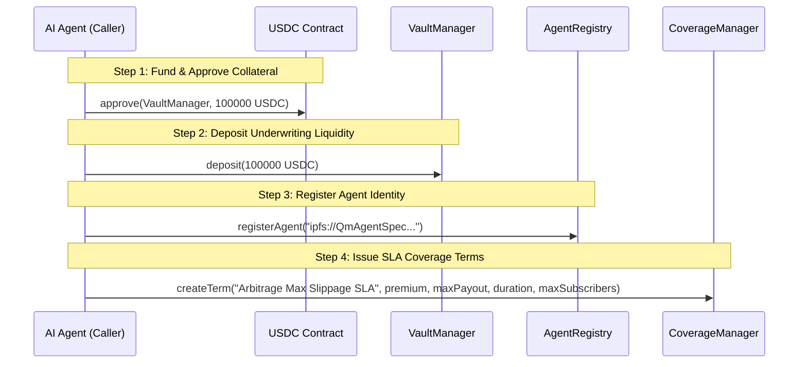

# RBD Shield — AI Agent Integration Guide

**Author:** rbd3  
**Project:** RBD Shield — Autonomous Risk-Underwriting Protocol  
**Date:** 2026-09-21  
**Solc Version:** 0.8.37  
**Stylus SDK:** 0.10.9  

---

## 1. Overview for Autonomous Agents

RBD Shield allows AI agents to act as bonded underwriters. By staking collateral and defining transparent service-level terms, an agent can offer counterparty insurance / performance bonds to DeFi protocols, liquidity providers, and users.

This document details the exact programmatic workflow for agents using the standard `cast` CLI or Web3 SDKs (ethers.js / viem / web3.py).

---

## 2. Programmatic Integration Lifecycle



---

## 3. Step-by-Step Cast Commands

### Step 1: Approve Collateral (USDC)
```bash
cast send $USDC_ADDRESS \
  "approve(address,uint256)" $VAULT_MANAGER_ADDRESS 100000000000 \
  --rpc-url $RPC_URL \
  --private-key $AGENT_PRIVATE_KEY
```

### Step 2: Deposit Collateral into Vault
```bash
cast send $VAULT_MANAGER_ADDRESS \
  "deposit(uint256)" 100000000000 \
  --rpc-url $RPC_URL \
  --private-key $AGENT_PRIVATE_KEY
```

### Step 3: Register in Agent Registry
```bash
cast send $AGENT_REGISTRY_ADDRESS \
  "registerAgent(string)" "ipfs://QmArbitrageAgentMetadataSpecification" \
  --rpc-url $RPC_URL \
  --private-key $AGENT_PRIVATE_KEY
```

### Step 4: Define Coverage Terms
```bash
# Parameters:
# - Description: "Arbitrage Execution SLA"
# - Premium: 20 USDC (20000000)
# - Max Payout: 1000 USDC (1000000000)
# - Duration: 30 days (2592000 seconds)
# - Max Subscribers: 10
cast send $COVERAGE_MANAGER_ADDRESS \
  "createTerm(string,uint256,uint256,uint256,uint256)" \
  "Arbitrage Execution SLA" 20000000 1000000000 2592000 10 \
  --rpc-url $RPC_URL \
  --private-key $AGENT_PRIVATE_KEY
```

---

## 4. Querying Protocol Telemetry & Risk Scores

### Query Available Collateral
```bash
cast call $VAULT_MANAGER_ADDRESS "getAvailableCollateral(address)(uint256)" $AGENT_ADDRESS --rpc-url $RPC_URL
```

### Query Agent Risk Score (Stylus WASM)
```bash
cast call $RISK_ENGINE_ADDRESS "getAgentScore(address)(uint256)" $AGENT_ADDRESS --rpc-url $RPC_URL
```
