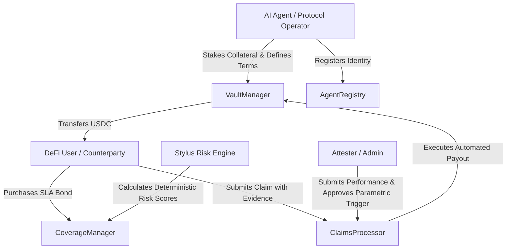

# RBD Shield — System Architecture

**Author:** rbd3  
**Project:** RBD Shield — Autonomous Risk-Underwriting Protocol  
**Target:** Arbitrum Open House Singapore Buildathon (Sep 14 – Oct 4, 2026)  
**Solidity Compiler:** 0.8.37  
**Rust / Stylus SDK:** 0.10.9  

---

## 1. Executive Summary & Vision

RBD Shield is an on-chain risk-underwriting and performance-bond protocol purpose-built for the emerging AI agent economy on Arbitrum and Robinhood Chain. 

As autonomous agents execute trades, manage liquidity, execute cross-chain operations, and manage funds, users and protocols require verifiable financial guarantees rather than passive reputation scores. RBD Shield provides an on-chain mechanism where agents stake collateral into dedicated vaults to back specific service-level agreements (SLAs). When pre-agreed failure or underperformance criteria occur, affected users can claim parametric payouts directly from the agent's bonded vault.

---

## 2. Core Actors

1. **AI Agents:** Deposit USDC/collateral into `VaultManager`, register in `AgentRegistry`, and configure coverage parameters in `CoverageManager`.
2. **Coverage Buyers (Users / Counterparties):** Purchase protection against agent failure/underperformance by paying a defined premium.
3. **Attesters / Admins:** Validate parametric claims and attest to external performance conditions for the MVP.
4. **Stylus Risk Engine:** Pure Rust WASM execution engine that computes agent risk scores and maximum permissible underwriting capacity with minimal gas.

---

## 3. Architecture & Contract Responsibilities

### 3.1 Contract Overview

| Contract | Technology | Purpose |
|----------|------------|---------|
| `RBDShieldCore.sol` | Solidity 0.8.37 | Base role-based access control (`AccessControl`), protocol pause (`Pausable`), global constants. |
| `AgentRegistry.sol` | Solidity 0.8.37 | Agent lifecycle (Registration, Metadata updates, Staking status, Suspension, Deregistration). |
| `VaultManager.sol` | Solidity 0.8.37 | Collateral custody, locked vs available accounting, deposit/withdraw mechanics, payout execution. |
| `CoverageManager.sol` | Solidity 0.8.37 | Parametric term creation, premium collection, policy activation, capacity verification, policy expiry. |
| `ClaimsProcessor.sol` | Solidity 0.8.37 | Claim submission by policyholders, validation, evidence hashing, approval/rejection, payout dispatch. |
| `RiskEngine` | Rust / Stylus WASM | Deterministic risk scoring using 18-decimal fixed-point math, calculating risk tiers and capacity multipliers. |

---

## 4. Financial & Accounting Invariants

To guarantee protocol solvency and prevent fractional reserve risks or insolvency cascades, the protocol enforces mathematical invariants at all times:

1. **Solvency Invariant:**
   $$\text{Vault USDC Balance} \ge \sum \text{totalDeposited} - \sum \text{totalClaimsPaid}$$

2. **Per-Agent Available Liquidity:**
   $$\text{available}(agent) = \text{totalDeposited}(agent) - \text{lockedAmount}(agent) - \text{totalClaimsPaid}(agent)$$
   $$\text{available}(agent) \ge 0 \quad \forall t$$

3. **Coverage Underwriting Backing:**
   $$\text{lockedAmount}(agent) \ge \sum_{c \in \text{ActivePolicies}(agent)} \text{maxPayout}(c)$$
   No policy can be purchased unless $\text{available}(agent) \ge \text{policy.maxPayout}$.

4. **Withdrawal Invariant:**
   An agent can only withdraw up to $\text{available}(agent)$. Withdrawals that exceed available balance revert unconditionally.

---

## 5. Security & Threat Model (MVP)

1. **Reentrancy Protection:** All fund-moving routines (`deposit`, `withdraw`, `executePayout`, `purchaseCoverage`) implement OpenZeppelin's `ReentrancyGuardTransient` / `ReentrancyGuard` and strictly follow Check-Effects-Interactions (CEI).
2. **Double-Spend & Over-Subscription:** Coverage purchases lock collateral instantaneously in the same transaction. If requested max payout exceeds available collateral, the transaction reverts.
3. **Claim Front-Running & Replays:** Claims require unique policy IDs and are bound to `msg.sender == policy.user`. A policy transitions to `Claimed` upon claim settlement, preventing multiple payouts for the same bond.
4. **Token Handling:** All token operations use OpenZeppelin `SafeERC20` with standard 6-decimal USDC support.
