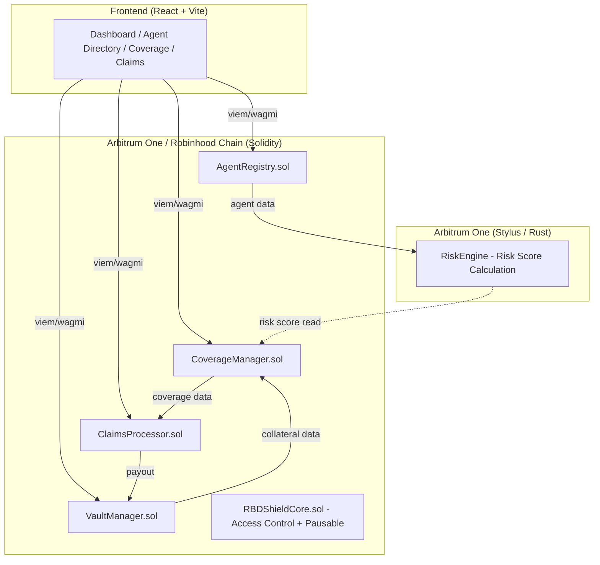

# RBD Shield — Implementation Plan

> **Hackathon:** Arbitrum Open House Singapore Buildathon (Sep 14 – Oct 4, 2026)
> **Prize Pool:** $115K Buildathon + $300K Founder House
> **Deadline:** ~13 days remaining

---

## 1. Executive Summary

RBD Shield is an on-chain risk-underwriting protocol where AI agents stake collateral to back the quality of their decisions, creating financial recourse (not prevention) when verifiable performance conditions are met. The project targets Arbitrum's agent economy infrastructure gap and competes in both the **Overall Track** and the **Robinhood Chain reserved slot**.

**Architecture:** Solidity core contracts on Arbitrum One / Robinhood Chain + Rust/Stylus risk-scoring engine on Arbitrum One + React/Vite frontend.

**Approach:** Parametric bond model (not traditional insurance) to avoid regulatory minefields. Agents deposit collateral → define service-level terms → users purchase coverage → on-chain data triggers claims → automated payouts from the vault.

---

## 2. Critical Assumption Review

### ✅ Verified Facts

| Fact | Evidence |
|------|----------|
| Robinhood Chain is live (mainnet July 1, 2026) | Public RPC, Chain ID 4663, EVM-compatible |
| Robinhood Chain is an Arbitrum Orbit chain | Built on Arbitrum Nitro stack |
| Robinhood Chain supports Stylus/WASM contracts | Inherits from Arbitrum Orbit tech stack |
| Stylus is live on Arbitrum One + Sepolia | `cargo-stylus 0.10.9` confirmed working |
| Hackathon has reserved Robinhood Chain slots | Research confirms 1 of 3 top prizes is reserved |
| Hackathon runs Sep 14 – Oct 4, 2026 | Confirmed |
| Foundry project compiles + tests pass | Verified: 2 tests pass (Counter template) |
| Stylus project compiles but tests fail | `stylus_sdk::testing` not found — needs `stylus-test` feature |

### ⚠️ Assumptions Requiring Confirmation

| Assumption | Risk | Mitigation |
|-----------|------|------------|
| Robinhood Chain testnet is accessible (Chain ID 46630) | Medium — may require API key or registration | Develop on Arbitrum Sepolia first, deploy to Robinhood testnet before mainnet |
| Monte Carlo / VaR can run in Stylus within gas limits | High — complex math is gas-expensive even in WASM | MVP uses simple weighted-average risk score, not full VaR. Stylus engine handles fixed-point arithmetic only |
| Stylus ↔ Solidity cross-contract calls work on Robinhood Chain | Medium — not every Orbit chain activates Stylus identically | Deploy Solidity-only on Robinhood Chain, Stylus on Arbitrum One. Cross-chain calls are out of MVP scope |
| "Insurance" terminology is safe for a hackathon demo | Low for hackathon, high for production | Use "performance bond" / "service-level guarantee" terminology throughout |

### ❌ Rejected Assumptions

| Original Claim | Reality |
|----------------|---------|
| "$100 USDC collateral is economically viable" | $100 is fine for demo but cannot underwrite meaningful coverage. The MVP acknowledges this as illustrative |
| "Continuous Monte Carlo simulations on-chain" | Infeasible even on Stylus. MVP uses deterministic, formula-based risk scoring |
| "Trading P&L automatically triggers claims" | P&L is off-chain and manipulable. MVP uses verifiable on-chain metrics or admin-attested data |

---

## 3. Recommended MVP Scope

### MUST HAVE (MVP Core)

| Feature | Justification |
|---------|--------------|
| Agent Registry contract | Core identity primitive |
| Vault + Collateral deposits (USDC/ETH) | Financial foundation |
| Coverage Terms definition | Defines what's covered |
| Coverage Purchase by users | Two-sided marketplace |
| Simple Risk Score (Stylus) | Arbitrum-native differentiator |
| Claim submission + payout | Complete lifecycle |
| Basic frontend (5 pages) | Demo-able prototype |
| Deployment to Arbitrum Sepolia + Robinhood testnet | Hackathon requirement |

### SHOULD HAVE (if time permits)

| Feature | Justification |
|---------|--------------|
| Premium payment flow | Economic model completeness |
| Agent performance reporting | Risk engine input |
| Gas comparison demo (EVM vs Stylus) | Compelling demo moment |
| Agent health check / heartbeat | Liveness proof |

### FUTURE (Post-Hackathon)

| Feature | Reason to Defer |
|---------|----------------|
| Oracle integration (Chainlink/Pyth) | Adds complexity, not essential for demo |
| Dispute resolution | Requires governance design |
| Cross-chain deployment | MVP is single-chain |
| Full Monte Carlo risk engine | Computationally infeasible on-chain |
| Agent SDK / npm package | Build after protocol stabilizes |
| Multi-token collateral | USDC-only simplifies accounting |

---

## 4. Technology Stack

| Technology | Role | Justification | MVP Required? |
|-----------|------|---------------|--------------|
| **Solidity 0.8.24+** | Core contracts (Registry, Vault, Coverage, Claims) | Industry standard, Foundry-native, auditable | ✅ |
| **Foundry (forge, anvil, cast)** | Build, test, deploy Solidity | Already initialized, fastest iteration | ✅ |
| **Rust + Stylus SDK 0.10.9** | Risk-scoring engine | Arbitrum-native advantage, demo differentiator | ✅ |
| **OpenZeppelin Contracts** | Access control, ReentrancyGuard, Pausable, ERC20 interfaces | Battle-tested security primitives | ✅ |
| **React + Vite + TypeScript** | Frontend | Fast build, modern DX | ✅ |
| **viem + wagmi** | Wallet/contract interaction | Type-safe, modern Ethereum library | ✅ |
| **Anvil** | Local devnet | Foundry-native, zero config | ✅ |

---

## 5. System Architecture



### Contract Responsibilities

| Contract | Responsibility |
|----------|---------------|
| `RBDShieldCore.sol` | Shared access control (Owner, Admin, Pauser), emergency pause, protocol-wide constants |
| `AgentRegistry.sol` | Agent registration, metadata, status (Active/Suspended/Deregistered), staking requirement |
| `VaultManager.sol` | Collateral deposits/withdrawals, locked/available accounting, USDC token handling |
| `CoverageManager.sol` | Coverage term creation, user purchase, expiration, capacity tracking |
| `ClaimsProcessor.sol` | Claim submission, validation, approval/rejection, payout execution |
| `RiskEngine` (Stylus) | Deterministic risk score from on-chain inputs (collateral ratio, claims history, coverage utilization) |

---

## 6. Phase-by-Phase Implementation Plan

---

### PHASE 0: Repository Discovery & Validation

**Objective:** Understand what exists, fix the broken Stylus test, establish baselines.

**Why it matters:** The prompt demands inspecting before building. Two issues found: (1) `foundry.toml` has unknown `project_name` config warning, (2) Stylus tests fail because `stylus-test` feature is missing.

**Prerequisites:** None.

**Tasks:**

1. Read `AGENT.md` ✅ (done during research)
2. Inspect all existing files ✅ (done during research)
3. Fix `foundry.toml` warning — remove `project_name` (not a valid Foundry config key)
4. Fix Stylus `Cargo.toml` — add `stylus-test` feature to `[dev-dependencies]`
5. Verify both projects compile + test green
6. Document findings in `IMPLEMENTATION_STATUS.md`

**Files to modify:**
- [foundry.toml](file:///home/rbd3/PROJECTS/RBD%20SHIELD/rbd-shield/foundry.toml) — remove `project_name`
- [Cargo.toml](file:///home/rbd3/PROJECTS/RBD%20SHIELD/stylus-risk-engine/Cargo.toml) — add `[dev-dependencies]` with `stylus-test` feature
- `IMPLEMENTATION_STATUS.md` [NEW] — create progress tracker

**Testing:** `forge build && forge test` (expect 2 pass), `cargo test` (expect 1 pass after fix)

**Acceptance Criteria:**
- [ ] Both projects compile without warnings (except known Foundry config)
- [ ] All existing tests pass
- [ ] `IMPLEMENTATION_STATUS.md` created with Phase 0 status

---

### PHASE 1: Architecture & Economic Model

**Objective:** Finalize the parametric bond model before writing contracts.

**Why it matters:** Writing contracts without a defined economic model leads to redesigns. The prompt explicitly warns against this.

**Prerequisites:** Phase 0 complete.

**Tasks:**

1. Create `docs/ARCHITECTURE.md` with component diagram, data flow, actor model
2. Create `docs/DECISIONS.md` with architectural decision records (ADRs)
3. Define the coverage model:
   - **Parametric Bond Model:** Agent deposits collateral. Coverage terms define a verifiable trigger (e.g., "if agent's on-chain collateral ratio drops below X%, user can claim up to Y USDC"). This is NOT insurance — it's a performance bond.
   - Coverage lifecycle: Created → Active → Expired/Claimed
   - Claim lifecycle: Submitted → Validated → Approved/Rejected → Paid
4. Define accounting invariants:
   - `totalDeposited >= totalLocked + totalAvailable`
   - `totalLocked >= sum(activeCoverageMaxPayouts)`
   - `vault.available >= 0` at all times
   - No withdrawal if it would make `available < 0`
5. Define threat model (top 5 attacks for MVP)

**Files to create:**
- `docs/ARCHITECTURE.md` [NEW]
- `docs/DECISIONS.md` [NEW]

**Acceptance Criteria:**
- [ ] Architecture document reviewed (by user)
- [ ] Economic model defined with explicit limitations
- [ ] No unresolved blockers for Phase 2

---

### PHASE 2: Development Environment & Foundation

**Objective:** Set up the actual project structure with dependencies.

**Prerequisites:** Phase 1 approved.

**Tasks:**

1. Install OpenZeppelin contracts: `forge install OpenZeppelin/openzeppelin-contracts --no-commit`
2. Configure `foundry.toml`:
   - Set `solc_version = "0.8.24"`
   - Set remappings: `@openzeppelin/=lib/openzeppelin-contracts/contracts/`
   - Enable optimizer (200 runs)
   - Set `ffi = false`, `fuzz.runs = 256`
3. Create directory structure:

```
rbd-shield/
├── src/
│   ├── core/           # Access control, shared base
│   ├── interfaces/     # All interfaces (I*.sol)
│   ├── libraries/      # Shared math, constants
│   ├── AgentRegistry.sol
│   ├── VaultManager.sol
│   ├── CoverageManager.sol
│   └── ClaimsProcessor.sol
├── test/
│   ├── unit/           # Per-contract tests
│   ├── integration/    # Multi-contract tests
│   ├── fuzz/           # Fuzz tests
│   └── mocks/          # MockERC20, etc.
├── script/
│   └── Deploy.s.sol
└── docs/
```

4. Create `MockERC20.sol` for testing (6 decimal USDC mock)
5. Create shared constants library: `Constants.sol` (BPS_DENOMINATOR, MIN_COLLATERAL, etc.)
6. Delete default `Counter.sol`, `Counter.t.sol`, `Counter.s.sol`
7. Verify clean build

**Files to modify:**
- [foundry.toml](file:///home/rbd3/PROJECTS/RBD%20SHIELD/rbd-shield/foundry.toml) — full config
- `src/Counter.sol` [DELETE]
- `test/Counter.t.sol` [DELETE]
- `script/Counter.s.sol` [DELETE]

**Files to create:**
- `src/interfaces/IAgentRegistry.sol` [NEW]
- `src/interfaces/IVaultManager.sol` [NEW]
- `src/interfaces/ICoverageManager.sol` [NEW]
- `src/interfaces/IClaimsProcessor.sol` [NEW]
- `src/libraries/Constants.sol` [NEW]
- `src/libraries/Errors.sol` [NEW]
- `src/libraries/Events.sol` [NEW]
- `src/core/RBDShieldCore.sol` [NEW]
- `test/mocks/MockERC20.sol` [NEW]

**Testing:** `forge build` — no errors, no warnings. `forge test` — tests pass (even if 0 tests initially).

**Acceptance Criteria:**
- [ ] Project compiles with all interfaces and base contracts
- [ ] MockERC20 deployed in test setUp
- [ ] Directory structure matches architecture

---

### PHASE 3: Core Smart Contract Foundation — AgentRegistry

**Objective:** Implement agent registration, the first concrete contract.

**Prerequisites:** Phase 2 complete.

**Contract: `AgentRegistry.sol`**

**Purpose:** On-chain registry of AI agents who participate in the protocol.

**Storage:**
```solidity
mapping(address => Agent) public agents;
uint256 public agentCount;
uint256 public minRegistrationStake;

struct Agent {
    address agentAddress;
    string metadataURI;       // IPFS or URL to agent description
    AgentStatus status;
    uint256 registeredAt;
    uint256 totalCoverageIssued;
    uint256 totalClaimsPaid;
}

enum AgentStatus { Unregistered, Active, Suspended, Deregistered }
```

**External Functions:**
| Function | Access | Description |
|----------|--------|-------------|
| `registerAgent(string metadataURI)` | Any | Register as an agent. Requires `minRegistrationStake` deposit. |
| `updateMetadata(string metadataURI)` | Agent owner | Update agent's metadata URI |
| `suspendAgent(address agent)` | Admin | Suspend a misbehaving agent |
| `deregisterAgent()` | Agent owner | Self-deregister (only if no active coverage) |
| `getAgent(address)` | View | Return agent details |
| `isActiveAgent(address)` | View | Boolean check |

**Events:** `AgentRegistered`, `AgentSuspended`, `AgentDeregistered`, `AgentMetadataUpdated`

**Security:**
- Only one registration per address
- Cannot deregister with active coverage
- Admin-only suspension
- No external calls (pure storage operations)

**Testing (Phase 3 tests):**
- `test_RegisterAgent_Success` — register, verify state
- `test_RegisterAgent_AlreadyRegistered_Reverts` — duplicate registration
- `test_RegisterAgent_InsufficientStake_Reverts`
- `test_SuspendAgent_ByAdmin_Success`
- `test_SuspendAgent_ByNonAdmin_Reverts`
- `test_DeregisterAgent_WithActiveCoverage_Reverts`
- `test_DeregisterAgent_Success`
- `test_UpdateMetadata_ByNonOwner_Reverts`
- `testFuzz_RegisterAgent(address, string)` — fuzz registration

**Acceptance Criteria:**
- [ ] All 9+ tests pass
- [ ] Agent lifecycle: Unregistered → Active → Suspended/Deregistered
- [ ] Access control verified

---

### PHASE 4: Vault & Collateral Mechanics — VaultManager

**Objective:** Implement the financial foundation (USDC deposits, locked/available accounting).

**Prerequisites:** Phase 3 complete.

**Contract: `VaultManager.sol`**

**Storage:**
```solidity
IERC20 public collateralToken;  // USDC

mapping(address => Vault) public vaults;

struct Vault {
    uint256 totalDeposited;
    uint256 lockedAmount;      // backing active coverage
    uint256 totalClaimsPaid;
    bool exists;
}
```

**Key Invariants (tested as assertions):**
- `available = totalDeposited - lockedAmount - totalClaimsPaid`
- `available >= 0` always
- `lockedAmount >= sum of all active coverage maxPayouts for this agent`
- `withdraw(amount)` reverts if `amount > available`

**External Functions:**
| Function | Access | Description |
|----------|--------|-------------|
| `deposit(uint256 amount)` | Active agent | Deposit USDC into vault |
| `withdraw(uint256 amount)` | Agent owner | Withdraw available (unlocked) collateral |
| `lockCollateral(address agent, uint256 amount)` | CoverageManager | Lock collateral for new coverage |
| `unlockCollateral(address agent, uint256 amount)` | CoverageManager | Unlock on coverage expiry |
| `executePayout(address agent, address user, uint256 amount)` | ClaimsProcessor | Transfer USDC from vault to user |
| `getAvailable(address agent)` | View | Available = deposited - locked - claimsPaid |

**Security:**
- ReentrancyGuard on all mutating functions
- SafeERC20 for token transfers
- Only whitelisted contracts can lock/unlock/payout (role-based)
- Check-effects-interactions pattern

**Testing:**
- `test_Deposit_Success` — deposit, verify balances
- `test_Deposit_NotAgent_Reverts`
- `test_Withdraw_AvailableBalance_Success`
- `test_Withdraw_ExceedsAvailable_Reverts`
- `test_Withdraw_WithLockedCollateral_PartialSuccess`
- `test_LockCollateral_ByCoverageManager_Success`
- `test_LockCollateral_ByUnauthorized_Reverts`
- `test_ExecutePayout_Success` — verify USDC transfer
- `test_ExecutePayout_InsufficientFunds_Reverts`
- `testFuzz_DepositWithdraw(uint256 deposit, uint256 withdraw)` — invariant checking
- `test_Reentrancy_Deposit_Reverts` — malicious token test

**Acceptance Criteria:**
- [ ] All 11+ tests pass
- [ ] Accounting invariants hold under fuzz testing
- [ ] Reentrancy protection verified

---

### PHASE 5: Coverage & Premium System — CoverageManager

**Objective:** Implement coverage term creation and user purchase.

**Prerequisites:** Phase 4 complete.

**Coverage Model:** Parametric Bond

- Agent creates coverage terms (what's covered, trigger condition, max payout, premium, duration)
- User pays premium, receives coverage NFT or coverage ID
- Coverage auto-expires after duration
- Claim eligibility is defined by the trigger condition (not subjective loss)

**Storage:**
```solidity
struct CoverageTerm {
    uint256 termId;
    address agent;
    string description;
    uint256 premiumAmount;     // USDC per coverage period
    uint256 maxPayout;         // maximum claim payout
    uint256 duration;          // coverage period in seconds
    uint256 maxSubscribers;
    uint256 currentSubscribers;
    bool active;
}

struct Coverage {
    uint256 coverageId;
    uint256 termId;
    address user;
    uint256 startTime;
    uint256 endTime;
    CoverageStatus status;
}

enum CoverageStatus { Active, Expired, Claimed, Cancelled }
```

**External Functions:**
| Function | Access | Description |
|----------|--------|-------------|
| `createTerm(...)` | Active agent | Define coverage terms |
| `purchaseCoverage(uint256 termId)` | Any user | Pay premium, activate coverage |
| `expireCoverage(uint256 coverageId)` | Anyone | Mark expired coverage (after endTime) |
| `getCoverage(uint256 coverageId)` | View | Return coverage details |
| `getAgentTerms(address agent)` | View | List terms for an agent |

**Testing:**
- `test_CreateTerm_Success`
- `test_CreateTerm_NotAgent_Reverts`
- `test_PurchaseCoverage_Success` — premium transferred, collateral locked
- `test_PurchaseCoverage_InsufficientCollateral_Reverts`
- `test_PurchaseCoverage_MaxSubscribersReached_Reverts`
- `test_PurchaseCoverage_InactiveAgent_Reverts`
- `test_ExpireCoverage_BeforeEndTime_Reverts`
- `test_ExpireCoverage_AfterEndTime_Success` — collateral unlocked
- `testFuzz_PurchaseMultipleCoverages(uint256 count)`

**Acceptance Criteria:**
- [ ] All 9+ tests pass
- [ ] Collateral correctly locked on purchase, unlocked on expiry
- [ ] Capacity tracking prevents over-subscription

---

### PHASE 6: Performance Data & Verification

**Objective:** Define how agent performance is reported and verified.

**Prerequisites:** Phase 5 complete.

**MVP Approach:** Admin-attested performance reports. The admin (protocol operator) submits performance snapshots. This is explicitly labeled as centralized and temporary.

> [!WARNING]
> Full oracle integration is **out of MVP scope**. The admin-attested model is a known centralization risk, documented as a limitation.

**What's Verifiable On-Chain (MVP):**
- Collateral ratio (deposit / locked)
- Claims history (count, total paid)
- Coverage utilization (active / capacity)

**What Requires External Trust (FUTURE):**
- Trading P&L
- Strategy performance
- Off-chain API uptime

**Implementation:** Add a `PerformanceReporter` role to `RBDShieldCore`. Admin submits performance snapshots that feed the risk engine.

**Storage:**
```solidity
struct PerformanceReport {
    address agent;
    uint256 timestamp;
    int256 performanceScore;   // basis points, can be negative
    address reporter;
}
```

**Testing:**
- `test_SubmitReport_ByReporter_Success`
- `test_SubmitReport_ByUnauthorized_Reverts`
- `test_SubmitReport_StaleTimestamp_Reverts`

---

### PHASE 7: Risk-Scoring Engine (Stylus/Rust)

**Objective:** Implement deterministic risk scoring in Rust, deployed as a Stylus contract.

**Prerequisites:** Phase 6 complete.

**Why Stylus:** Fixed-point arithmetic in Rust is safer and cheaper than Solidity. The gas comparison is a compelling demo moment.

**Risk Score Formula (MVP — NOT Monte Carlo):**

```
riskScore = w1 * collateralRatio + w2 * claimsRatio + w3 * utilizationRatio + w4 * ageScore
```

Where:
- `collateralRatio` = available / locked (higher is safer) — weight 40%
- `claimsRatio` = 1 - (claimsPaid / totalDeposited) (lower claims is safer) — weight 25%
- `utilizationRatio` = 1 - (active / capacity) (lower utilization is safer) — weight 20%
- `ageScore` = min(registrationAge / 365 days, 1) (older is safer) — weight 15%

All values in fixed-point (18 decimals). Score range: 0–10000 (basis points, where 10000 = safest).

**Files to modify:**
- [lib.rs](file:///home/rbd3/PROJECTS/RBD%20SHIELD/stylus-risk-engine/src/lib.rs) — replace Counter with RiskEngine

**Storage (Stylus):**
```rust
sol_storage! {
    #[entrypoint]
    pub struct RiskEngine {
        mapping(address => uint256) risk_scores;
        mapping(address => uint256) last_updated;
    }
}
```

**External Functions (Stylus):**
| Function | Description |
|----------|-------------|
| `calculate_risk_score(collateral_ratio, claims_ratio, utilization_ratio, age_score)` | Pure calculation, returns score |
| `update_agent_score(agent, score)` | Store score (admin only in MVP) |
| `get_agent_score(agent)` | Read stored score |

**Testing (Rust native tests):**
- `test_perfect_agent` — max scores → 10000
- `test_worst_agent` — min scores → 0
- `test_average_agent` — middle values
- `test_overflow_protection` — large inputs
- `test_zero_division_safety`
- `test_boundary_values` — 0, MAX_U256

**Acceptance Criteria:**
- [ ] `cargo test` passes all tests
- [ ] Risk score is deterministic (same inputs → same output)
- [ ] No panics on any input
- [ ] Gas comparison documented (Stylus vs equivalent Solidity)

---

### PHASE 8: Claims & Payout Mechanism

**Objective:** Implement the claim lifecycle.

**Prerequisites:** Phases 5, 6 complete.

**Contract: `ClaimsProcessor.sol`**

**Claim Flow (MVP):**
1. User submits claim with `coverageId` and evidence hash
2. Admin validates claim (centralized for MVP — documented limitation)
3. Approved claim triggers `VaultManager.executePayout`
4. Claim status updated, coverage marked as Claimed

**Storage:**
```solidity
struct Claim {
    uint256 claimId;
    uint256 coverageId;
    address claimant;
    uint256 amount;
    bytes32 evidenceHash;
    ClaimStatus status;
    uint256 submittedAt;
    uint256 resolvedAt;
}

enum ClaimStatus { Submitted, Approved, Rejected, Paid, Expired }
```

**External Functions:**
| Function | Access | Description |
|----------|--------|-------------|
| `submitClaim(uint256 coverageId, uint256 amount, bytes32 evidenceHash)` | Coverage holder | Submit a claim |
| `approveClaim(uint256 claimId)` | Admin | Approve claim |
| `rejectClaim(uint256 claimId, string reason)` | Admin | Reject claim |
| `executePayout(uint256 claimId)` | Internal | Transfer funds after approval |

**Security:**
- Only coverage holder can submit
- Claim amount ≤ coverage maxPayout
- Coverage must be Active and not expired
- One claim per coverage (MVP simplification)
- ReentrancyGuard on payout
- Replay protection via ClaimStatus check

**Testing:**
- `test_SubmitClaim_Success`
- `test_SubmitClaim_NotHolder_Reverts`
- `test_SubmitClaim_ExpiredCoverage_Reverts`
- `test_SubmitClaim_AlreadyClaimed_Reverts`
- `test_SubmitClaim_ExceedsMaxPayout_Reverts`
- `test_ApproveClaim_ByAdmin_Success`
- `test_ApproveClaim_ByNonAdmin_Reverts`
- `test_ExecutePayout_TransfersUSDC`
- `test_ExecutePayout_InsufficientVault_Reverts`
- `test_RejectClaim_Success`

---

### PHASE 9: AI Agent Integration (Minimal)

**Objective:** Define how agents interact with the protocol programmatically.

**Prerequisites:** Phase 8 complete.

**MVP Approach:** No SDK. Agents interact directly with contracts via standard ABI calls (ethers.js, viem, cast). The "integration" is the contract ABI itself.

**Tasks:**
1. Generate contract ABIs via `forge build`
2. Create `docs/AGENT_INTEGRATION.md` with:
   - Registration flow (call `registerAgent`)
   - Deposit flow (approve USDC → call `deposit`)
   - Create coverage terms (call `createTerm`)
   - Example scripts using `cast`
3. Create example TypeScript integration script

**No additional contracts needed for this phase.**

---

### PHASE 10: Frontend & User Experience

**Objective:** Build 5 essential pages for the demo.

**Prerequisites:** Phase 8 complete (contracts deployed to local Anvil).

**Pages:**

| Page | Purpose | Key Actions |
|------|---------|-------------|
| **Dashboard** | Protocol overview stats | View TVL, agent count, coverage stats |
| **Agent Directory** | Browse registered agents | Search, filter, view risk scores |
| **Agent Detail** | Single agent profile | View vault, terms, risk score, claims history |
| **Purchase Coverage** | Buy coverage from agent | Select term, pay premium, confirm tx |
| **My Coverage** | User's active/past coverage | View status, submit claims |

**Tech:** React + Vite + TypeScript + viem + wagmi + RainbowKit (wallet connect).
bsi
**Tasks:**
1. Initialize Vite project: `npx -y create-vite@latest ./ --template react-ts`
2. Install deps: `viem`, `wagmi`, `@rainbow-me/rainbowkit`
3. Configure Arbitrum Sepolia + Anvil chains
4. Create contract ABI imports (auto-generated from forge)
5. Build 5 pages with loading/error/empty states
6. Style with modern dark theme, glassmorphism
7. Test wallet connection + transaction flow on Anvil

**Acceptance Criteria:**
- [ ] All 5 pages render without errors
- [ ] Wallet connects to Anvil
- [ ] At least 1 complete transaction flow works end-to-end

---

### PHASE 11: End-to-End Integration

**Objective:** Connect everything for a complete demo flow.

**Prerequisites:** Phases 8, 10 complete.

**Demo Flow:**

| Step | Action | Status |
|------|--------|--------|
| 1 | Agent registers | Fully implemented |
| 2 | Agent deposits 100 USDC | Fully implemented |
| 3 | Agent creates coverage term | Fully implemented |
| 4 | User browses agents | Fully implemented |
| 5 | User purchases coverage (pays 5 USDC premium) | Fully implemented |
| 6 | Admin submits performance report | Admin-attested (labeled) |
| 7 | Risk engine updates score | Stylus call (may be simulated if cross-chain) |
| 8 | User submits claim | Fully implemented |
| 9 | Admin approves claim | Centralized (labeled) |
| 10 | Payout executes (20 USDC to user) | Fully implemented |
| 11 | Frontend reflects updated state | Fully implemented |

**Testing:**
- Full e2e test in Foundry (`test/integration/E2ETest.t.sol`)
- Frontend e2e on Anvil (manual verification)

---

### PHASE 12: Security Review

**Objective:** Audit the implementation before deployment.

**Top 5 Threat Vectors for MVP:**

| Threat | Impact | Mitigation |
|--------|--------|------------|
| **Reentrancy on payout** | Drain vault | ReentrancyGuard + CEI pattern |
| **Vault over-commitment** | Insufficient funds for claims | Capacity check before locking |
| **Admin key compromise** | Approve fraudulent claims | Multisig recommended post-MVP |
| **Flash loan attack on collateral ratio** | Manipulate risk score | Snapshot-based scoring, not live |
| **Front-running coverage purchase** | Grief users | Not economically viable at MVP scale |

**Tasks:**
1. Run `slither` (if available) or manual review
2. Review all `external` functions for access control
3. Verify all arithmetic uses SafeMath / Solidity 0.8+ checks
4. Verify all ERC20 interactions use SafeERC20
5. Document findings in `docs/SECURITY_NOTES.md`

---

### PHASE 13: Deployment & Demonstration

**Objective:** Deploy to Arbitrum Sepolia and Robinhood testnet.

**Tasks:**
1. Create deployment script (`script/Deploy.s.sol`)
2. Deploy MockERC20 (USDC) to testnet
3. Deploy all contracts in order: Core → Registry → Vault → Coverage → Claims
4. Verify contracts on Arbiscan
5. Configure frontend for testnet
6. Run full demo flow on testnet
7. Record demo video

**Deployment Order:**
```
1. MockERC20 (testnet only)
2. RBDShieldCore
3. AgentRegistry
4. VaultManager (pass USDC address)
5. CoverageManager (pass VaultManager, AgentRegistry)
6. ClaimsProcessor (pass VaultManager, CoverageManager)
7. Grant roles (CoverageManager → VaultManager.LOCKER_ROLE, etc.)
```

**Environment Variables (`.env` — NEVER committed):**
```
PRIVATE_KEY=          # deployer key (testnet only)
RPC_URL_SEPOLIA=      # Arbitrum Sepolia RPC
RPC_URL_ROBINHOOD=    # Robinhood testnet RPC
ETHERSCAN_API_KEY=    # for verification
```

---

## 7. Testing Strategy

| Level | Tool | Coverage |
|-------|------|----------|
| **Unit** | `forge test` | Every public function, every revert path |
| **Fuzz** | `forge test` (built-in fuzzer) | Deposit/withdraw, coverage amounts, boundary values |
| **Invariant** | `forge test` (invariant mode) | Vault accounting invariants |
| **Integration** | `forge test` (multi-contract) | Full lifecycle tests |
| **Stylus** | `cargo test` | Risk score calculations |
| **Frontend** | Manual + browser devtools | Wallet connect, tx flow, error states |
| **E2E** | Anvil + frontend | Full demo flow |

**Test naming convention:** `test_FunctionName_Scenario_ExpectedResult`

---

## 8. Documentation & Progress Tracking

**`IMPLEMENTATION_STATUS.md`** — Updated after every phase. Contains:
- Current phase, overall status
- Phase-by-phase status table
- Completed work log (date, task, files, tests)
- Pending work
- Known issues
- Next recommended task

**Other docs:**
- `docs/ARCHITECTURE.md` — System design, component diagram
- `docs/DECISIONS.md` — ADRs with reasoning
- `docs/SECURITY_NOTES.md` — Known risks, mitigations
- `README.md` — Updated with project description, setup, demo instructions

---

## 9. Security & Economic Risk Assessment

| Risk | Severity | MVP Mitigation | Future Mitigation |
|------|----------|---------------|-------------------|
| Admin can approve fraudulent claims | **High** | Documented limitation, single admin key | Multisig, dispute resolution, oracle validation |
| Agent can under-collateralize | **Medium** | Capacity check on coverage creation | Dynamic margin requirements |
| User can manipulate performance data | **Medium** | Admin-attested data only in MVP | Oracle-based verification |
| USDC depeg | **Low** | Accept the risk, document it | Multi-collateral support |
| Smart contract bug | **High** | Tests, manual review | Professional audit |
| Vault insolvency (claims > deposits) | **Medium** | maxPayout ≤ available collateral check | Insurance fund, re-insurance |

**Regulatory Note:** The MVP uses "performance bond" and "service-level guarantee" terminology, NOT "insurance." The protocol does NOT promise guaranteed financial protection. All limitations are documented.

---

## 10. Hackathon Demonstration Plan

**Demo Script (5 minutes):**

1. **Opening (30s):** "RBD Shield creates financial accountability for AI agents — this is only possible on Arbitrum because we use Stylus for 50x cheaper risk calculations."
2. **Agent Registration (45s):** Show agent registering, depositing 100 USDC, creating coverage terms
3. **User Purchase (45s):** Show user browsing agents, reviewing risk scores, purchasing coverage
4. **Risk Engine (60s):** Show Stylus risk score calculation, gas comparison with EVM equivalent
5. **Claim Flow (60s):** Show claim submission, approval, USDC payout
6. **Frontend (45s):** Walk through dashboard, agent directory, coverage status
7. **Close (15s):** TAM — $400B+ insurance industry, agent-specific risk underwriting is a greenfield niche

**Demo Assets Needed:**
- Pre-funded testnet wallets (agent + user)
- Pre-deployed contracts on Arbitrum Sepolia
- Gas comparison screenshot (Stylus vs EVM)

---

## 11. Recommended Implementation Order

```
Phase 0  → Day 1          (repository fix, baseline)
Phase 1  → Day 1-2        (architecture, model)
Phase 2  → Day 2          (project setup, dependencies)
Phase 3  → Day 2-3        (AgentRegistry)
Phase 4  → Day 3-4        (VaultManager)
Phase 5  → Day 4-5        (CoverageManager)
Phase 6  → Day 5          (PerformanceReporter — small)
Phase 7  → Day 5-6        (Stylus RiskEngine)
Phase 8  → Day 6-7        (ClaimsProcessor)
Phase 9  → Day 7          (Agent integration docs)
Phase 10 → Day 7-9        (Frontend)
Phase 11 → Day 9-10       (E2E integration)
Phase 12 → Day 10-11      (Security review)
Phase 13 → Day 11-13      (Deployment + demo prep)
```

---
bsite
## 12. First Implementation Task

**After reading this plan and receiving approval, the first concrete task is:**

### Phase 0, Task 1: Fix existing project issues

1. Remove `project_name` from `foundry.toml`
2. Add `[dev-dependencies]` to Stylus `Cargo.toml` with `stylus-test` feature:
   ```toml
   [dev-dependencies]
   stylus-sdk = { version = "0.10.9", features = ["stylus-test"] }
   ```
3. Run `forge build && forge test` — expect 2 pass
4. Run `cargo test` — expect 1 pass
5. Create `IMPLEMENTATION_STATUS.md` with initial status

**This task does NOT assume any architecture is implemented. It fixes what exists.**

---

## Open Questions

> [!IMPORTANT]
> **Q1: Target chain for demo?**
> Deploy Solidity contracts to Arbitrum Sepolia AND Robinhood testnet, or just one?
> Recommendation: Arbitrum Sepolia primary, Robinhood testnet if time permits (for dual-track prize eligibility).

> [!IMPORTANT]
> **Q2: Stylus contract deployment target?**
> Stylus contracts deploy to Arbitrum One/Sepolia. Robinhood Chain *should* support Stylus but hasn't been independently verified. Plan: deploy Stylus to Arbitrum Sepolia, call it from frontend. If Robinhood supports it, deploy there too.

> [!IMPORTANT]
> **Q3: Frontend scope — minimal or polished?**
> The prompt says "don't build unnecessary visual features before core functionality works." However, the hackathon is visual. Recommendation: functional first (Phases 0-8), polish second (Phase 10).

> [!IMPORTANT]
> **Q4: Should the README/docs reference "SentinelVault"?**
> The strategy doc uses "SentinelVault" but the prompt says "RBD Shield." Recommendation: use "RBD Shield" everywhere, mention "formerly SentinelVault" once in README.
